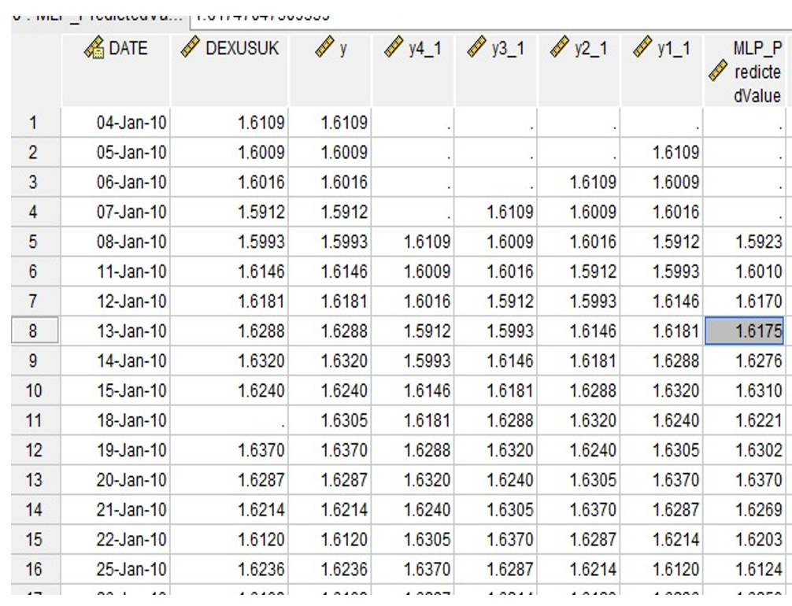
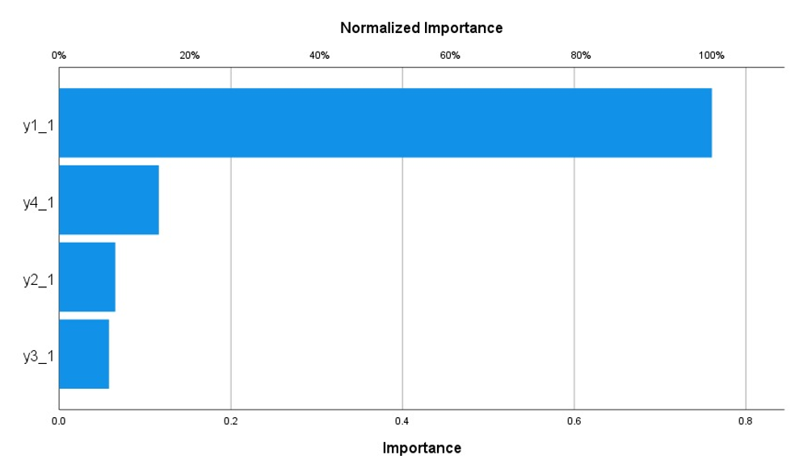

<!DOCTYPE html>
<html lang="en">
<head>
  <meta charset="UTF-8">
  <title>Neural Network Forecasting: UK–US Exchange Rate</title>
  
</head>
<body>
  <h1>Exchange Rate Forecasting Using Neural Networks (ANN): GBP/USD</h1>
  
  <h2>Project Overview</h2>
  

    This project applies a neural network (ANN) model to forecast the GBP/USD exchange rate using daily time series data from January 2010 to August 2020. The primary goal is to accurately predict the exchange rate for August 8, 2020. The project follows a data science workflow: data preparation, variable selection, ANN modeling, performance evaluation, and forecast reporting.
  

  <h2>Dataset Description</h2>
  <ul>
    <li><b>Source:</b> <a href="https://fred.stlouisfed.org/series/DEXUSUK" target="_blank">FRED: Federal Reserve Economic Data</a> (Board of Governors of the Federal Reserve System (US))</li>
    <li><b>Coverage:</b> Jan 4, 2010 – Aug 7, 2020 (daily rates)</li>
    <li><b>Variables:</b>
      <ul>
        <li>Date</li>
        <li>DEXUSUK (GBP/USD exchange rate)</li>
        <li>Lagged exchange rates: LAGS(y,1) to LAGS(y,5) (previous 5 days)</li>
      </ul>
    </li>
    <li><b>File Provided:</b> <code>exchange-rate-uk-us-data.xlsx</code></li>
  </ul>
   
  <b>Figure 1.</b> Variables and structure of the dataset, showing all lagged inputs used for the neural network.

  <h2>Variable Selection</h2>
  

    The **target** variable is the GBP/USD exchange rate for August 8, 2020. Five lagged values (previous 5 days) are used as **input features**, as they best capture short-term autocorrelation, as confirmed by autocorrelation analysis.
  

   
  <b>Figure 2.</b> Visualization of input (lagged) and output variables for forecasting.

  <h2>Model Architecture</h2>
  <ul>
    <li>Multilayer Perceptron (MLP) neural network</li>
    <li><b>Input layer:</b> 5 neurons (lagged values: LAGS(y,1) to LAGS(y,5))</li>
    <li><b>Hidden layer:</b> 1 (number of neurons auto-selected by SPSS)</li>
    <li><b>Activation functions:</b> Hyperbolic tangent (hidden), Identity (output)</li>
    <li><b>Output layer:</b> 1 neuron (predicted exchange rate)</li>
    <li><b>Training/test split:</b> 70%/30%</li>
    <li>Data normalization performed automatically in SPSS</li>
  </ul>
   
  <b>Figure 3.</b> ANN model structure: input (left), hidden (center), output (right), showing weight signs.

  <h2>Model Training & Performance</h2>
   
  <b>Figure 4.</b> Model summary: Training and test errors. Low relative errors show high performance and no overfitting.

  <h3>Input Importance</h3>
   
  <b>Figure 5.</b> Relative importance of lagged inputs. Lag 1 (yesterday's value) has the highest predictive power, as expected.
   
  <b>Figure 6.</b> Table: Normalized importance for each lagged input (SPSS output).

  <h2>Forecast Results</h2>
   
  <b>Figure 7.</b> ANN forecast for August 8, 2020. Predicted exchange rate: <b>1.3119</b>
   
  <b>Figure 8.</b> Actual vs. predicted exchange rate (SPSS chart output).
   
  <b>Figure 9.</b> Detailed error statistics (Sum of Squares, Relative Error) for train/test splits.

  <h2>Interpretation and Discussion</h2>
  <ul>
    <li>The neural network achieved **very low error** on both training and testing data, indicating strong generalizability and lack of overfitting.</li>
    <li>Lag 1 was by far the most important predictor, confirming the strong autocorrelation in daily FX rates.</li>
    <li>The forecasted value closely matches the observed recent values, showing ANN suitability for short-term FX forecasting.</li>
  </ul>

  <h2>Conclusion</h2>
  

    The ANN (MLP) model provided an accurate and interpretable forecast for the GBP/USD rate on August 8, 2020. The choice of input lags is justified by the dominance of recent rates in the prediction. The model structure and performance metrics demonstrate that this method is well-suited for one-step-ahead exchange rate forecasting in practice.
  

</body>
</html>
